<p align="center">
  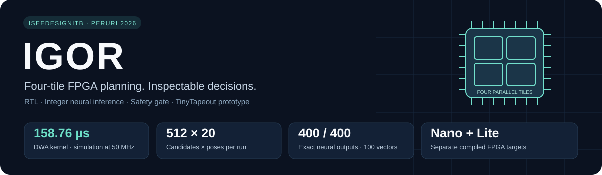
</p>

<p align="center">
  <strong>IGOR · Indonesian Gated Onboard Robotics</strong><br>
  <strong>Peruri Chip Hackathon 2026</strong><br>
  <strong>ISeeDesignITB</strong><br>
  Cutting Edge Physical AI Technology for Inference Security
</p>

<p align="center">
  
  
  
  
</p>

<p align="center">
  <a href="docs/README.md">Dokumentasi</a> ·
  <a href="docs/QUICKSTART.md">Mulai di sini</a> ·
  <a href="docs/FPGA_PROGRAMMING.md">Program FPGA</a> ·
  <a href="docs/DEMO_GUIDE.md">Panduan demo</a> ·
  <a href="docs/TECHNICAL_REPORT.md">Laporan teknis</a> ·
  <a href="#hasil-eksperimen-model-ai-cl-drl-dan-akselerator-q88">Eksperimen AI</a>
</p>

## Mengapa IGOR

Robot pengangkut material perlu mengambil keputusan cepat sekaligus menjaga pekerja dan barang di sekitarnya. Usulan gerak dapat menjadi tidak layak ketika peta belum lengkap, informasi sudah kedaluwarsa, atau pengaturan berubah. IGOR dirancang sebagai prosesor pendamping yang memeriksa pilihan gerak dan menentukan izin pada rangkaian FPGA.

Proposal tim menempatkan logistik internal PERURI sebagai penerapan awal yang diusulkan. Repository ini memuat fondasi teknisnya: pemeriksa lintasan, pemilih gerak, gerbang izin, inti inferensi, serta perangkat pengujian yang dapat ditelusuri dari source hingga hasil. Pilot pada rute nyata merupakan tahap pengembangan berikutnya.

## Dari peta menjadi keputusan yang bisa diperiksa

IGOR mengevaluasi kandidat gerak pada costmap 128 × 128 menggunakan empat evaluator paralel. Setiap evaluator menangani 128 kandidat dengan 20 pose per kandidat. Hasil terbaik melewati `igor_safety_security_gate`, lalu tersedia sebagai izin, kode kecepatan, kode kecepatan sudut, dan status kesalahan.

Repository ini menyatukan RTL, model numerik, bobot BRAM, testbench, proyek Quartus, bitstream `.sof`, diagram, dan bukti implementasi. Neural core **24 → 64 → 64 → 4** tersedia sebagai jalur inferensi terpisah. Subset gerbang keselamatan juga disiapkan dalam antarmuka TinyTapeout.

### Alur kerja yang tersedia

1. **Masukkan peta dan konfigurasi.** Host mengirim instruksi melalui UART **115200 baud, 8N1**, dalam paket delapan byte dengan CRC8. Peta 128 × 128 sel ditulis ke bank yang sedang tidak digunakan.
2. **Aktifkan peta lengkap.** Pengelola memeriksa kelengkapan dan nomor urut sebelum mengaktifkan bank peta sekaligus. Empat salinan memori memberi setiap evaluator port baca sendiri.
3. **Periksa 512 pilihan gerak.** Empat tile DWA bekerja paralel, masing-masing mengevaluasi 128 kandidat pada 20 pose perkiraan. Kandidat yang melewati rintangan, keluar peta, atau mengalami kesalahan aritmetika dibatalkan.
4. **Pilih hasil terbaik.** Selector memilih skor terendah dengan aturan indeks terendah saat skor sama.
5. **Putuskan izin.** `igor_safety_security_gate` memeriksa validitas peta, konfigurasi, hasil, deadline, batas gerak, dan masukan penghentian. Pada `igor_top`, izin serta kedua keluaran perintah hanya berasal dari gerbang ini. Saat syarat gagal, gerbang menutup izin dan menolkan perintah.
6. **Baca hasil dan status.** Keluaran berupa izin **1 bit**, kode kecepatan **5 bit**, laju belok bertanda **7 bit**, kode gangguan **8 bit**, dan penghitung kejadian **32 bit**. Konversi hasil menjadi setpoint roda dan pengiriman ke motor berada pada tahap integrasi sistem.

Pemeriksa memakai model robot sebagai titik pada costmap yang rintangannya telah diperluas oleh host. Validasi bentuk robot, pengereman, dan respons fisik mengikuti tahap pengujian perangkat. Spesifikasi bilangan serta batas antarmuka tersedia pada [arsitektur](docs/ARCHITECTURE.md).

### Inti AI dan sistem tanpa laptop

Proposal menempatkan pengendali **Soft Actor-Critic (SAC)** sebagai alternatif penentu gerak DWA/DWB. Inti inferensi fixed-point **24 → 64 → 64 → 4** sudah memiliki ROM, instruksi, dan pengujian numerik tersendiri. Penyatuan keluaran AI dengan pemeriksa lintasan dan gerbang menjadi target **Fase 1**. Pengujian DWA dan neural yang ditampilkan di bawah mengukur kedua jalur secara terpisah. Dokumentasi eksperimen pelatihan kurikulum (CL-DRL), telemetri, dan validasi generalisasi OOD disajikan pada [seksi eksperimen AI](#hasil-eksperimen-model-ai-cl-drl-dan-akselerator-q88).

DE10-Nano memiliki **FPGA fabric** untuk komputasi dan gerbang, serta **HPS ARM** yang dapat menjalankan Linux. Jalur yang tersedia saat ini memakai UART host untuk pengujian awal. Integrasi sensor, transfer peta melalui HPS, bridge gerbang menuju controller motor, dan pengukuran sensor hingga motor merupakan tahap berikutnya. Target latensi sistem **p99 ≤ 5 ms** berbeda dari hasil kernel **158,76 µs**.

Paket [JetAuto](docs/JETAUTO.md) menyediakan pengujian motor dan referensi UART STM **1 Mbps**. Proyek motor tersebut merupakan alat uji transport tersendiri. [Referensi receiver DE10-Nano](robot/jetauto/UART_RX_BUZZER_REFERENCE/README.md) menjelaskan decode paket dan perbedaan pin terhadap transmitter motor. Untuk STM yang hanya diakses melalui USB, tersedia [template transport HPS USB host](robot/hps_usb).

## Hasil utama

| Hasil | Angka | Bukti |
|---|---:|---|
| Evaluasi DWA | **512 kandidat × 20 pose** | [RTL dan arsitektur](docs/ARCHITECTURE.md) |
| Waktu kernel DWA | **7.938 siklus · 158,76 µs pada 50 MHz** | [Enam scene](evidence/audit/scene_latency.csv) |
| Inferensi neural | **400 keluaran cocok tepat pada 100 vektor** | [Hasil model pembanding](verification/neural_cocotb_results.json) |
| Waktu kernel neural | **18.192 siklus · 363,84 µs pada 50 MHz** | [Analisis performa](docs/PERFORMANCE.md) |
| Pemeriksaan RTL tercatat | **29.382 pemeriksaan tanpa kesalahan** | [Manifest bukti simulasi](evidence/waveforms/MANIFEST_BUKTI.json) |
| Regresi gerbang | **13.078 kasus · 12/12 bin hasil fungsional** | [Coverage](verification/gate_functional_coverage.json) |
| Regresi cocotb lokal | **8 test case pada 6 suite** | [Metodologi](docs/VERIFICATION.md) |
| Fault injection | **9 skenario menghasilkan izin = 0** | [Daftar pengujian](evidence/audit/fault_status.csv) |
| Implementasi FPGA | **DE10-Nano dan DE10-Lite** | [Resource dan timing](docs/PERFORMANCE.md) |
| Diagram modul | **1 file `.io` dengan 28 halaman** | [Buka sumber diagram](docs/flowcharts/IGOR_RTL_Flowchart.io) |

Angka waktu pada tabel adalah hasil kernel simulasi. Evaluasi DWA lengkap memerlukan 7.938 siklus pada keenam scene yang direkam. Angka ini tidak menyatakan waktu hingga roda bergerak atau keunggulan terhadap CPU yang belum dibandingkan pada beban identik. Cakupan pengukuran, asumsi daya, dan tahapan integrasi dijelaskan pada [catatan hasil](docs/RESULTS_AND_SCOPE.md).

Implementasi DE10-Nano memakai **4.964 ALM, 131 M10K, dan 10 DSP**, dengan timing memenuhi clock **50 MHz**. Power Analyzer menghasilkan estimasi **506,69 mW** secara vectorless dengan confidence rendah. Ini estimasi rangkaian FPGA, bukan pengukuran konsumsi seluruh board dan HPS. Laporan asli serta hasil DE10-Lite tersedia pada [resource, timing, dan daya](docs/PERFORMANCE.md).

## Arsitektur dalam satu pandangan

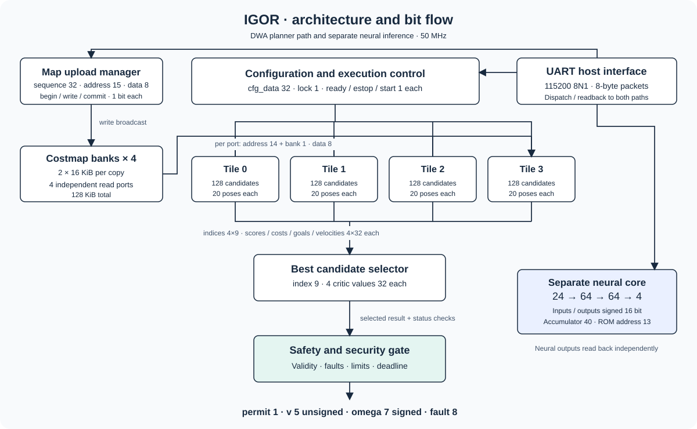

Lihat [breakdown seluruh modul RTL](docs/RTL_MODULES.md), [bit flow](docs/ARCHITECTURE.md), serta [register TinyTapeout](docs/info.md).

## Hasil Eksperimen Model AI: CL-DRL dan Akselerator Q8.8

Sebagai pelengkap evaluasi lintasan deterministik DWA, arsitektur IGOR mengintegrasikan modul kendali otonom berbasis **Curriculum-based Deep Reinforcement Learning (CL-DRL)** menggunakan algoritma **Soft Actor-Critic (SAC)** untuk robot holonomik Mecanum. Model ini dilatih melalui kurikulum 4-tahap progresif dan dikuantisasi penuh ke representasi fixed-point **Q8.8 bit-true signed 16-bit** agar kompatibel langsung dengan akselerator Block RAM (M10K) pada FPGA Cyclone V DE10-Nano.

Seluruh eksperimen pelatihan, komparasi numerik PyTorch FP32 vs Hardware Q8.8, serta pembuatan visualisasi dan ekspor bobot hardware terdokumentasi lengkap dalam notebook [notebook/V3_PERURI_Chip_Hackathon_2026_DRL.ipynb](notebook/V3_PERURI_Chip_Hackathon_2026_DRL.ipynb).

### 1. Arsitektur Jaringan dan Kurikulum 4-Tahap Progresif

* **Topologi Multi-Layer Perceptron (`24 → 64 → 64 → 4`)**:
  * **24 Input**: 16 jarak sinar LiDAR 2D, koordinat relatif target ($d_{goal}, \theta_{rel}$), orientasi hadap bodi robot terhadap target ($\theta_{yaw}$), dan kecepatan angular 4 roda Mecanum saat ini.
  * **Hidden Layers**: Dua lapisan tersembunyi masing-masing 64 neuron dengan aktivasi ReLU.
  * **4 Output**: Kecepatan individual aktuasi 4 roda Mecanum ($v_{FL}, v_{FR}, v_{RL}, v_{RR}$) dalam rentang $[-1.0, 1.0]$.
  * **Kuantisasi Q8.8**: 1 bit tanda, 7 bit integer, 8 bit fraksional (skala $256.0$). Akumulasi bit-true: $\text{acc} = \sum (w_{q8} \times x_{q8}) + (b_{q8} \ll 8)$.
* **Desain Kurikulum 4-Tahap (*4-Stage Progressive Curriculum*)**:
  1. **Tahap 1 — Basic Locomotion**: Lapangan kosong ($0$ rintangan), sasaran dekat ($0,8 - 1,8\text{ m}$), toleransi docking longgar $\pm 55^\circ$. Robot menguasai kinematika holonomik dalam $20 - 40$ langkah per episode.
  2. **Tahap 2 — Heading Alignment & Obstacle Avoidance**: Jarak menengah ($1,5 - 2,8\text{ m}$), $1 - 2$ rintangan, toleransi docking $\pm 35^\circ$. Robot mempelajari navigasi *Two-Stage Blended Heading* dan manuver mengelak.
  3. **Tahap 3 — Intermediate Clutter & Tight Yaw**: Jarak jauh ($2,0 - 3,8\text{ m}$), $2 - 3$ rintangan, toleransi docking presisi $\pm 26^\circ$. Penyelarasan orientasi diperketat.
  4. **Tahap 4 — Full Cluttered Maze Navigation**: Arena penuh ($2,0 - 4,5\text{ m}$), $3 - 5$ rintangan padat/labirin acak, toleransi docking target kompetisi $\pm 20^\circ$.

### 2. Dashboard Telemetri: PyTorch FP32 vs Hardware Bit-True Q8.8

Evaluasi episode benchmark (seed 101) membandingkan inferensi **PyTorch Float32 asli** dengan **Simulasi Hardware Bit-True Q8.8** membuktikan bahwa kuantisasi perangkat keras mempertahankan presisi kendali tanpa degradasi performa:

<table>
  <tr>
    <td width="50%"><a href="notebook/telemetry_dashboard.png">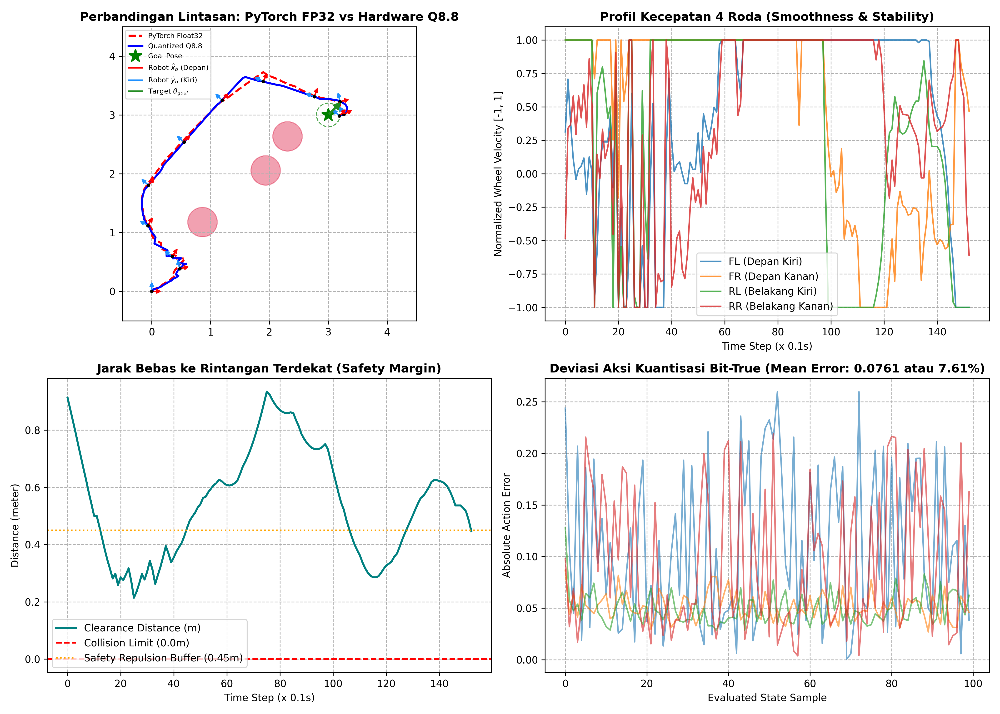</a><br><strong>Dashboard Telemetri (FP32 vs Hardware Q8.8)</strong></td>
    <td width="50%"><a href="notebook/unique_scenarios_validation.png">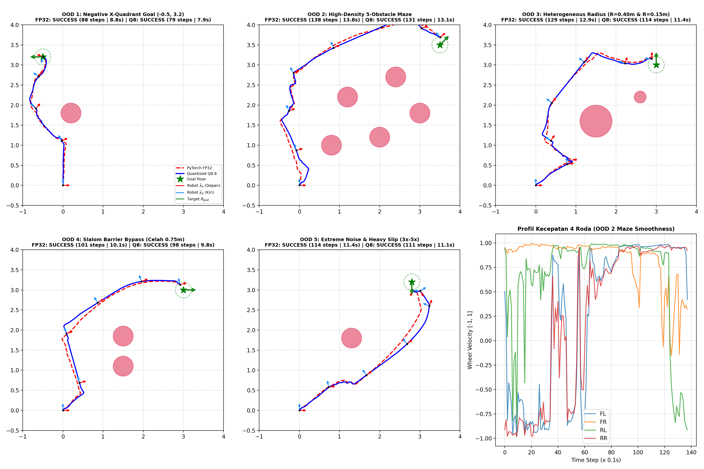</a><br><strong>Ringkasan Validasi 5 Skenario Uji Ekstrem (OOD)</strong></td>
  </tr>
</table>

* **Panel 1 (Lintasan 2D)**: Trajektori hardware Q8.8 berimpit presisi dengan model PyTorch FP32 hingga mencapai target.
* **Panel 2 (Discretization Error)**: Galat pointwise aksi $|\Delta u| = |a_{FP32} - a_{Q8.8}|$ berada di orde $\sim 10^{-3}$, menjamin akurasi kendali setara representasi floating-point kontinu.
* **Panel 3 (Profil Kecepatan 4 Roda)**: Aktuasi keempat motor roda Mecanum berjalan mulus (*smoothness*) tanpa sentakan atau osilasi tajam (*anti-chattering*).
* **Panel 4 (Safety Clearance Distance)**: Robot konsisten mempertahankan jarak bebas terhadap rintangan di atas ambang aman repulsi ($0,20\text{ m}$) dan tidak pernah menyentuh ambang tabrakan ($0,0\text{ m}$).

### 3. Validasi Keandalan pada 5 Skenario Ekstrem (*Out-of-Distribution Generalization*)

Untuk menguji kemampuan generalisasi di luar kondisi pelatihan nominal, model dievaluasi pada 5 skenario ekstrem Out-of-Distribution (OOD):

<table>
  <tr>
    <td width="50%" align="center">
      <a href="notebook/ood1_negative_x.gif">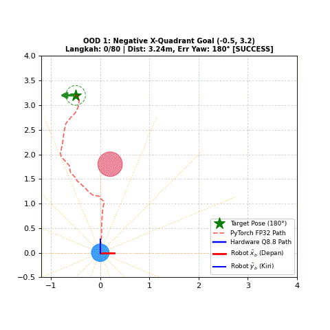</a><br>
      <strong>OOD 1: Negative X-Quadrant Goal</strong><br>
      <em>Target di kuadran negatif (-0.5, 3.2) m membuktikan kemampuan translasi holonomik mundur-lateral tanpa harus berputar haluan secara berlebihan.</em>
    </td>
    <td width="50%" align="center">
      <a href="notebook/ood2_5obstacle_maze.gif">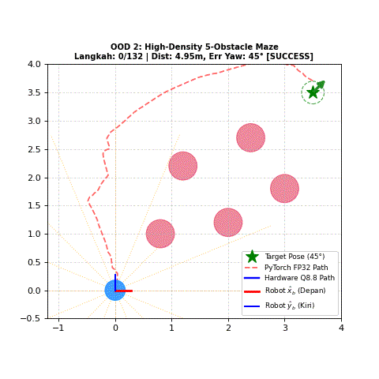</a><br>
      <strong>OOD 2: High-Density 5-Obstacle Maze</strong><br>
      <em>Labirin rapat 5 rintangan; model mengeksekusi manuver detour reaktif berbasis LiDAR tanpa terjebak jalan buntu (dead-end).</em>
    </td>
  </tr>
  <tr>
    <td width="50%" align="center">
      <a href="notebook/ood3_heterogeneous_radius.gif">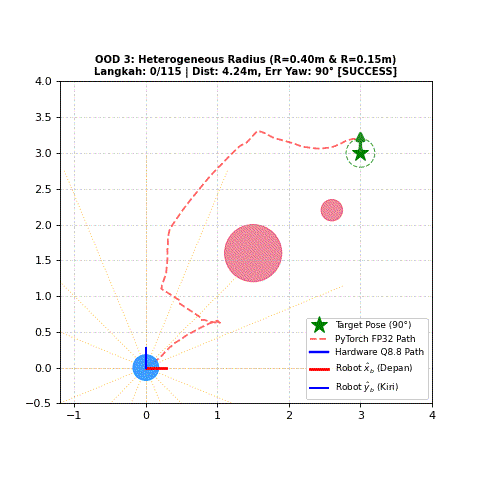</a><br>
      <strong>OOD 3: Heterogeneous Radius</strong><br>
      <em>Rintangan berukuran heterogen ekstrem (R=0.40 m dan R=0.15 m); membuktikan adaptasi buffer clearance yang fleksibel terhadap geometri non-standar.</em>
    </td>
    <td width="50%" align="center">
      <a href="notebook/ood4_slalom_barrier.gif">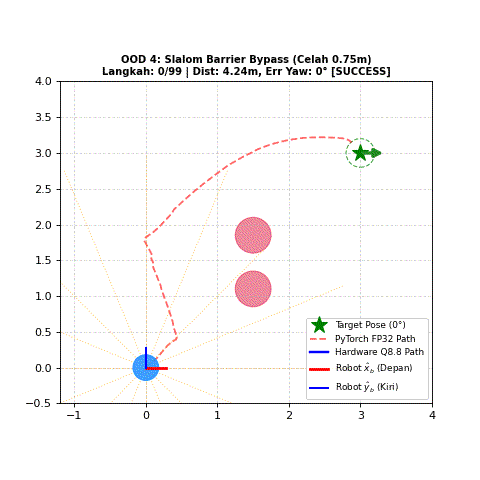</a><br>
      <strong>OOD 4: Slalom Barrier Bypass</strong><br>
      <em>Navigasi slalom melewati celah sempit 0.75 m di antara rintangan ganda dengan presisi lintasan tinggi.</em>
    </td>
  </tr>
  <tr>
    <td colspan="2" align="center">
      <a href="notebook/ood5_extreme_noise_slip.gif">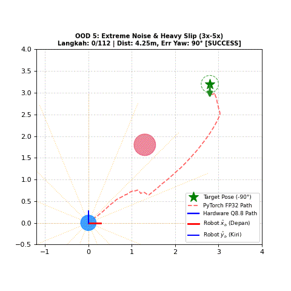</a><br>
      <strong>OOD 5: Extreme Noise & Heavy Slip</strong><br>
      <em>Injeksi derau sensor LiDAR (3×) dan selip roda fisik (5×); memvalidasi ketangguhan kontrol closed-loop terhadap gangguan lingkungan dan fisik nyata.</em>
    </td>
  </tr>
</table>

## Pilih jalur yang ingin dijalankan

| Tujuan | Mulai dari | Top module |
|---|---|---|
| Simulasi RTL dan pemeriksaan numerik | [Quickstart](docs/QUICKSTART.md) | `igor_top`, neural core, UART, dan wrapper |
| FPGA utama DE10-Nano | [Proyek Nano](fpga_de10_nano/README.md) | `igor_uart_top` |
| FPGA lab DE10-Lite MAX 10 | [Proyek Lite](fpga_de10_lite/README.md) | `igor_de10_lite_top` |
| Prototipe ASIC gerbang | [TinyTapeout](docs/TINYTAPEOUT.md) | `tt_um_wlmoi_igor_gate` |
| Pengujian motor UART empat kecepatan | [JetAuto](docs/JETAUTO.md) | `stm_uart_multispeed_top` |

### Jalankan regresi lokal

Linux atau WSL dengan Python 3.11:

```bash
git clone https://github.com/sundaysiagian/peruri-iseedesign.git
cd peruri-iseedesign
sudo apt-get update
sudo apt-get install -y iverilog make
python3 -m venv .venv
. .venv/bin/activate
python -m pip install -r requirements.txt
python scripts/validate_repository.py
python verification/run.py all
python verification/run.py tt_generic
```

Perintah `all` menjalankan tujuh test case. Suite `tt_generic` menambahkan test case kedelapan untuk netlist generik. Instruksi Windows ada di [Quickstart](docs/QUICKSTART.md).

### Buka di Quartus

| Board | Proyek yang dibuka | Image yang diprogram |
|---|---|---|
| DE10-Nano · `5CSEBA6U23I7` | [igor.qpf](fpga_de10_nano/quartus/igor.qpf) | [igor.sof](fpga_de10_nano/quartus/output_files/igor.sof) |
| DE10-Lite · `10M50DAF484C7G` | [igor_max10.qpf](fpga_de10_lite/quartus/igor_max10.qpf) | [igor_max10.sof](fpga_de10_lite/quartus/output_files/igor_max10.sof) |

Gunakan Quartus Standard 25.1 beserta device support yang sesuai. [Panduan programming](docs/FPGA_PROGRAMMING.md) memuat urutan JTAG, pin UART, reset, dan pemeriksaan hasil. Hash image tercatat di [build evidence](evidence/build_evidence.json).

### Folder Quartus Ready

Paket [ImplementationReadyQuartus](ImplementationReadyQuartus/README_MULAI_DI_SINI.md) dapat disalin langsung ke laptop lab atau onsite. Pilih [DE10-Nano](ImplementationReadyQuartus/IGOR_DE10_NANO/quartus/igor.qpf) atau [DE10-Lite](ImplementationReadyQuartus/MAX10_10M50DAF484C7G/quartus/igor_max10.qpf), lalu klik `BUKA_PROJECT_QUARTUS.bat` dalam folder board. Kedua paket menyertakan RTL, ROM, source constraints, SOF, dan report. [Receipt paket](ImplementationReadyQuartus/VERIFIKASI_PAKET.json) mencatat top, device, reference check, serta hash image terbaru.

## Bukti yang bisa dibuka

<table>
  <tr>
    <td width="50%"><a href="evidence/quartus/nano_resource.png">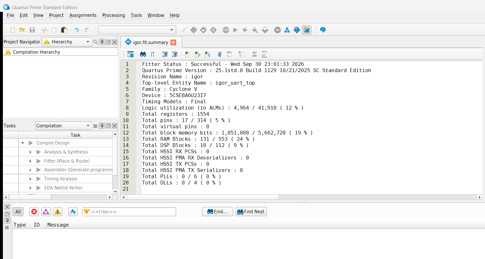</a><br><strong>Quartus · DE10-Nano</strong></td>
    <td width="50%"><a href="evidence/quartus/lite_resource.png">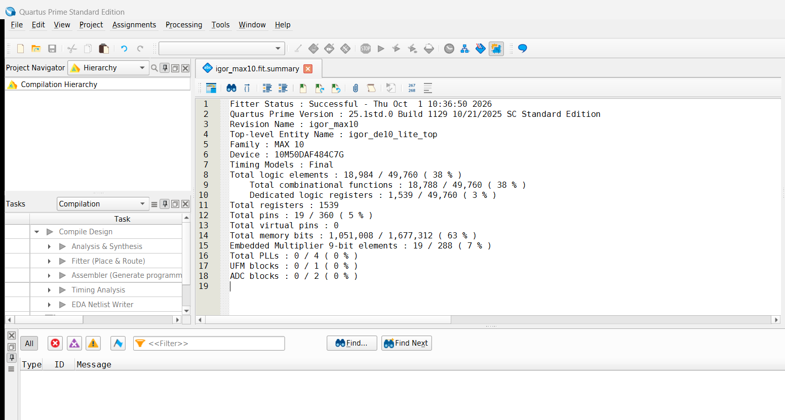</a><br><strong>Quartus · DE10-Lite</strong></td>
  </tr>
  <tr>
    <td><a href="evidence/waveforms/05_dwa_result.png">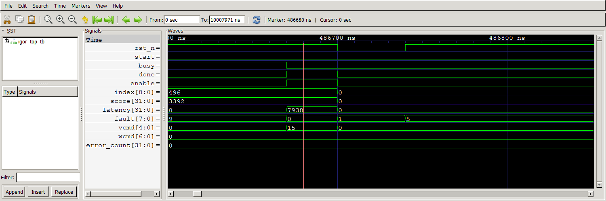</a><br><strong>GTKWave · hasil DWA</strong></td>
    <td><a href="evidence/waveforms/06_neural_result.png">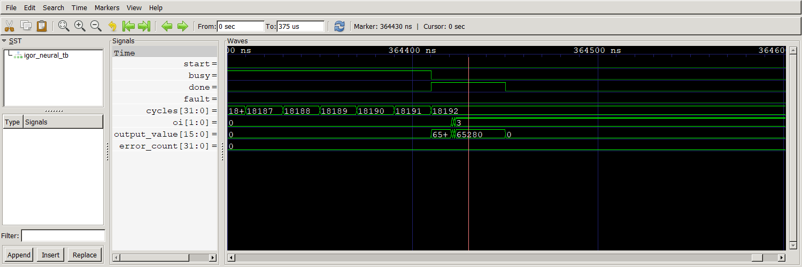</a><br><strong>GTKWave · hasil neural</strong></td>
  </tr>
</table>

Screenshot berasal dari aplikasi Quartus dan GTKWave. Laporan asli, waveform, XML hasil, dan data pembanding tetap tersedia dalam `evidence/` dan `verification/`. Baca [indeks bukti](docs/EVIDENCE.md) untuk menelusuri setiap angka.

## Peta repository

```text
peruri-iseedesign/
├── rtl/                  RTL accelerator FPGA
├── src/                  Wrapper dan gerbang TinyTapeout
├── assets/               ROM BRAM dan vektor neural
├── reference_model/      Model integer Python
├── verification/         Cocotb, assertion, dan hasil numerik
├── test/                 Harness standar TinyTapeout
├── fpga_de10_nano/       Proyek Cyclone V yang berdiri sendiri
├── fpga_de10_lite/       Proyek MAX 10 yang berdiri sendiri
├── robot/                SDK, BAT, UART RTL, dan transport HPS
├── notebook/             Notebook pelatihan CL-DRL & aset visualisasi
├── docs/                 Panduan, laporan teknis, diagram, dan demo
├── evidence/             Laporan, waveform, provenance, dan hash
└── .github/workflows/    Verifikasi serta jalur ASIC opsional
```

## Luaran proyek

| Luaran | Lokasi |
|---|---|
| Source RTL, testbench, dan bitstream | `rtl/`, `verification/`, `test/`, dan kedua folder FPGA |
| Laporan teknis singkat | [TECHNICAL_REPORT.md](docs/TECHNICAL_REPORT.md) |
| Pelatihan AI & kuantisasi CL-DRL | [notebook/](notebook/) dan [Jupyter Notebook](notebook/V3_PERURI_Chip_Hackathon_2026_DRL.ipynb) |
| Arsitektur dan flowchart modul | [ARCHITECTURE.md](docs/ARCHITECTURE.md) dan [file `.io`](docs/flowcharts/IGOR_RTL_Flowchart.io) |
| Panduan demo live pada board | [FPGA_PROGRAMMING.md](docs/FPGA_PROGRAMMING.md) |
| Rundown video demo 3–5 menit | [DEMO_GUIDE.md](docs/DEMO_GUIDE.md) |
| Knowledge dan pencapaian | [KNOWLEDGE.md](docs/KNOWLEDGE.md) dan [ACHIEVEMENTS.md](docs/ACHIEVEMENTS.md) |

## Tim dan kontribusi

**ISeeDesignITB · Institut Teknologi Bandung**

| Anggota | NIM |
|---|---|
| William Anthony | 13223048 |
| Karol Yangqian Poetracahya | 13523093 |
| Brian Albar Hadian | 13523048 |
| Bennaya Jonathan R. P. Siagian | 13223099 |

Pembimbing: **Anggera Bayuwindra, S.T., M.T., Ph.D.**

Template TinyTapeout dan komponen pihak ketiga dijelaskan dalam [referensi dan atribusi](docs/REFERENCES.md). Lihat [CONTRIBUTING.md](CONTRIBUTING.md) untuk cara mempertahankan hasil yang dapat direproduksi.


