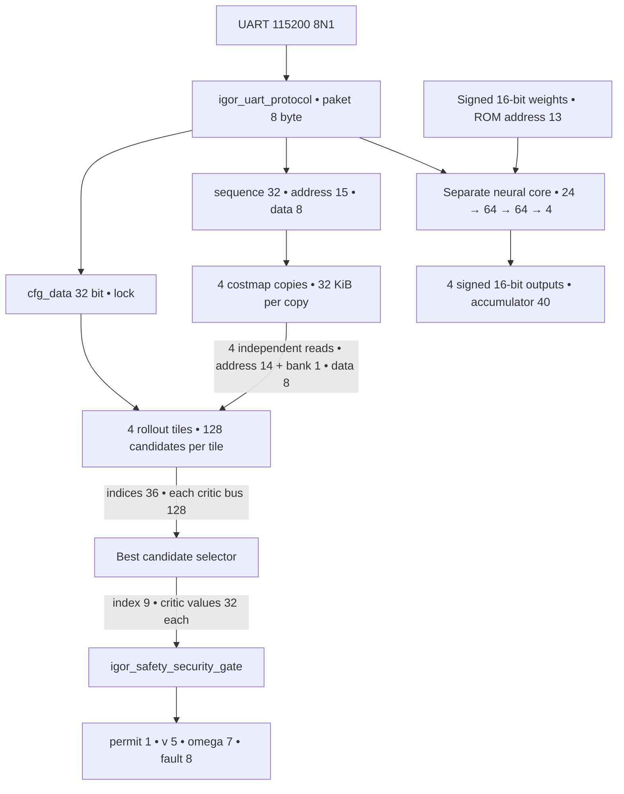

# Arsitektur dan bit flow

## Level 0

IGOR adalah planner lokal fixed-point untuk costmap yang sudah diinflasi. Jalur utama menerima konfigurasi dan peta, mengevaluasi kandidat DWA, memilih hasil terbaik, lalu memeriksa hasil melalui gerbang izin. Jalur inferensi neural memakai ROM dan input/output sendiri.

| Batas antarmuka | Nama | Lebar |
|---|---|---:|
| Konfigurasi | `cfg_data` | 32 bit |
| Kontrol konfigurasi | `cfg_write`, `cfg_lock` | 1 bit masing-masing |
| Urutan upload | `map_sequence` | 32 bit |
| Alamat tulis map | `map_address` | 15 bit |
| Data map | `map_byte` | 8 bit |
| Hasil terpilih | `selected_index` | 9 bit |
| Score dan tiga critic | `selected_score`, `selected_cost`, `selected_goal`, `selected_velocity` | 32 bit masing-masing |
| Izin gerak | `motor_enable` | 1 bit |
| Kode kecepatan | `v_command` | 5 bit unsigned |
| Kode kecepatan sudut | `omega_command` | 7 bit signed |
| Diagnostik | `fault_code` | 8 bit |
| Counter | `latency_cycles`, `event_count` | 32 bit masing-masing |

Kode v dan omega adalah keluaran digital planner. Konversi menjadi RPS dan transport ke controller motor merupakan batas integrasi tersendiri.

## Level 1

## Mengapa costmap direplikasi empat kali

Setiap copy mempunyai **32.768 × 8 bit**, yaitu dua frame **16.384 byte**. Total empat copy adalah **131.072 byte atau 128 KiB**. Double banking memungkinkan upload ke frame inactive, sementara planner menggunakan frame committed.

Empat tile membutuhkan alamat baca yang dapat berbeda pada siklus yang sama. Replikasi memberi port baca independen kepada setiap tile. Upload dibroadcast ke semua copy. Commit memilih frame lengkap sesuai kondisi manager. Memory ini memiliki fungsi berbeda dari ROM neural.

## Jadwal evaluator

Setiap kandidat memakai satu siklus inisialisasi, 20 pengulangan STEP / WAIT_RAM / SCORE, dan satu siklus penyelesaian. Jadwal tile adalah `128 × 62 = 7.936` siklus. Counter pada top menambahkan dua siklus, menghasilkan **7.938 siklus** pada enam scene yang direkam.

## Gerbang pada output

Pada [igor_top.v](../rtl/igor_top.v), `motor_enable`, `v_command`, dan `omega_command` didorong oleh instance `gate`. Gerbang memeriksa readiness, emergency, protection, validitas map/config/result, tile completion, arithmetic fault, deadline, batas kecepatan, dan perubahan kecepatan.

Sumber lengkap setiap modul ada pada [RTL_MODULES.md](RTL_MODULES.md). Diagram terperinci seluruh modul, FSM, level 0 dan level 1 tersedia dalam [file `.io` 28 halaman](flowcharts/IGOR_RTL_Flowchart.io).
