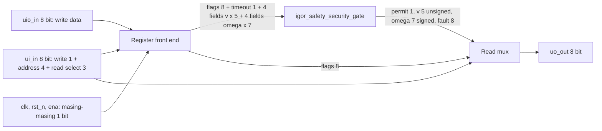

# How it works

Top `tt_um_wlmoi_igor_gate` membungkus modul aktual `igor_safety_security_gate` dengan register dan read mux. Gerbang memeriksa reset, readiness, emergency, protection, validitas map/config/result, penyelesaian tile, arithmetic fault, timeout, batas kecepatan, dan perubahan kecepatan. Jika pemeriksaan gagal, permit, v, dan omega menjadi nol.

Keluaran adalah kode digital. Prototipe tidak berisi DWA, neural core, USB host atau driver motor. Jalur ASIC ini merupakan subset desain FPGA.

## Block diagram and bit flow

`uio_out=0`, `uio_oe=0`, sehingga seluruh uio adalah input. Reset aktif rendah. Penulisan terjadi pada rising edge clk saat ena dan write_enable aktif. Pemeriksaan gate dan read mux kombinatorial. Target clock 50 MHz belum merupakan Fmax ASIC yang dibuktikan.

## Register map

Alamat `ui_in[4:1]`, write_enable `ui_in[0]`, data `uio_in`.

| Address | Register | Size |
|---|---|---|
| 0 | flags | 8 bit |
| 1 | timeout | bit 0 |
| 2 | candidate_v | 5 bit unsigned |
| 3 | previous_v | 5 bit unsigned |
| 4 | max_v | 5 bit unsigned |
| 5 | max_dv | 5 bit unsigned |
| 6 | candidate_w | 7 bit signed two's complement |
| 7 | previous_w | 7 bit signed two's complement |
| 8 | max_w | 7 bit unsigned |
| 9 | max_dw | 7 bit unsigned |
| 10–15 | reserved | Writes ignored |

Flags bit 0 ready, 1 emergency, 2 protection, 3 map valid, 4 config valid, 5 result valid, 6 all done, 7 arithmetic fault. Semua register reset ke nol.

Read select `ui_in[7:5]`: 0 permit di bit 0, 1 v zero-extended, 2 omega sign-extended, 3 fault code, 4 flags, 5–7 nol. Deassert write_enable saat membaca.

| Fault code | Meaning |
|---|---|
| 0 | Permit aktif |
| 1 | Reset |
| 2 | Emergency |
| 3 | Protection |
| 4 | Not ready atau ena=0 |
| 5 | Map invalid |
| 6 | Config invalid |
| 7 | Arithmetic fault |
| 8 | Timeout |
| 9 | Result invalid atau tile belum selesai |
| 10 | Velocity limit |
| 11 | Acceleration limit |

# How to test

1. Assert rst_n=0 dan beri clock. Pastikan permit nol. Lepas reset, ena=1.
2. Tulis flags=0 terlebih dahulu. Ini wajib ketika memperbarui parameter agar konfigurasi campuran tidak diterima saat permit aktif.
3. Tulis timeout=0, candidate_v=4, previous_v=4, max_v=15, max_dv=15, candidate_w=0, previous_w=0, max_w=32, max_dw=32.
4. Tulis flags=0x79 terakhir. Baca permit=1, v=4, omega=0.
5. Tulis flags=0x7B. Baca permit=0, v=0, omega=0, fault=2.
6. Jalankan `make -C test` atau `python verification/run.py tt`. Cocotb menguji 1.010 konfigurasi, reset, ena, dan semua fault code.

Register interface ini adalah harness dengan host tepercaya. Tidak ada autentikasi atau update konfigurasi atomik. Upload peta terlindungi berada pada desain FPGA terpisah.

# External hardware

Tester Tiny Tapeout atau mikrokontroler dengan tegangan sesuai board, clock, 16 input data dan 8 output baca. Label seluruh pin tersedia dalam info.yaml. Keluaran ini tidak boleh langsung disambungkan ke motor.

# Physical implementation status

Target IHP CMOS5L, requested size 1×1 tile. GDS, DRC/LVS, precheck, PDK gate-level test, daya ASIC dan fit tile belum diverifikasi lokal. Workflow resmi disediakan. Desain FPGA lengkap memakai top igor_uart_top di folder terpisah.
