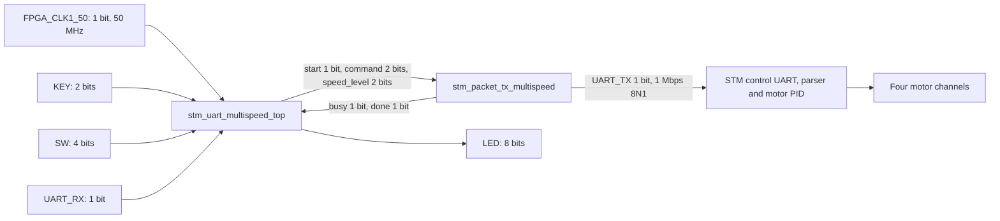

# Four-speed DE10-Nano RTL UART demo and Verilog testbenches

## Current result

RTL simulation and Quartus compilation pass. The new image implements 15, 30, 60 and 90 RPM commands for all four motor IDs, a six-second motion lease and a 50 ms refresh interval.

The laptop four-speed run was a **partial physical pass**. The user observed all four wheels moving at the first forward stage, 15 RPM. Later stages moved only three wheels, with the rear-left wheel remaining still. The user subsequently reported that the second wheel could move independently. This does not establish a supply fault, and it does not establish reliable simultaneous operation at every speed.

Latest longer-run observation: PARTIAL. All four worked individually. Rear-left was delayed in the rear pair and failed in the all-four group. Root cause remains unmeasured.

Latest diagonal/staged run observation: awaiting diagonal and staggered-start observations. The new launcher is `RUN_NEW_DIAGONAL_STAGED_TEST.bat`. See `BAT_TEST_TUTORIAL.md` in the complete handover package.

No DE10-Nano hardware was available for a physical FPGA test. Laptop COM9 tests use a USB host on the PC. The first four-speed laptop run sent the exact bytes decoded from RTL simulation. Per-channel and longer diagnostics construct SDK-compatible packets in Python. These are distinct transport tests.

## Copyable folder and top module

Copy the complete `FPGA_UART_TTL_MULTISPEED` folder to keep its relative paths valid. Open `quartus/stm_uart_multispeed.qpf`. Choose **stm_uart_multispeed_top** as the top entity and **5CSEBA6U23I7** as the FPGA.

| File | Purpose |
|---|---|
| rtl/stm_uart_multispeed_top.v | Button and switch synchronizers, debounce, arm, six-second timer, refresh and STOP controller |
| rtl/stm_packet_tx_multispeed.v | Ten packet ROM banks and UART serializer |
| tb/tb_multispeed.v | Independent serial receiver checks all four speed levels in both directions, motor IDs, float bits and CRC |
| tb/tb_multispeed_control.v | Integration checks boot STOP, disarmed buzzer, speed selection, latching, periodic refresh, timeout STOP and arm-clear STOP |
| tb/rtl_captured_packets.hex | Actual UART bytes decoded from the RTL testbench |
| multispeed.vcd | Packet testbench waveforms for GTKWave |
| run_verilog_tests.ps1 | Compile and run both Verilog testbenches |
| build_quartus.ps1 | Run synthesis, fitting, assembly and timing analysis |
| quartus/stm_uart_multispeed.qpf and .qsf | Portable Quartus project and source paths |
| quartus/pin_assignment.tcl and stm_uart.sdc | IO assignments and 50 MHz constraint |
| quartus/output_files/stm_uart_multispeed.sof | Current six-second four-speed programming image |
| evidence/ | Simulation logs, Quartus logs and source/image hashes |

The previous two-second single-speed project remains in the separate `FPGA_UART_TTL` folder.

## Four speeds and controls

The STM protocol uses RPS, so **RPS = RPM / 60**. These are requested speed setpoints. Actual speed was not measured with encoder feedback.

| SW1 | SW0 | Level | RPM | RPS | Positive float32 bits | Forward CRC | Reverse CRC |
|---|---|---:|---:|---:|---|---|---|
| 0 | 0 | 0 | 15 | 0.25 | 3E800000 | 3D | 7C |
| 0 | 1 | 1 | 30 | 0.50 | 3F000000 | 15 | 54 |
| 1 | 0 | 2 | 60 | 1.00 | 3F800000 | 0D | 4C |
| 1 | 1 | 3 | 90 | 1.50 | 3FC00000 | 01 | 40 |

SW2 selects direction, 0 forward and 1 backward. SW3 arms motion. With SW3=1, a KEY1 press starts one six-second session at the selected speed and direction. With SW3=0, KEY1 sends the buzzer command. Release KEY1 before pressing it again. Holding it does not repeat sessions.

Speed and direction latch when the session starts. Changing SW0, SW1 or SW2 during motion does not change that running session. Clearing SW3 requests STOP after any current UART frame finishes. Boot sends STOP. KEY0 resets the logic and restarts boot STOP, and is not an independent physical emergency stop.

LED0 indicates UART busy. LED1 indicates a controller state other than idle. LED3:2 show the latched speed level. LED4 shows arm. LED5 shows the latched backward command. LED6 mirrors UART_RX as a raw level. LED7 is zero. RX has no packet decoder or motor acknowledgement logic.

## Module and bit flow



Controller state is three bits. Command and speed level are two bits each. The six-second hold counter is 29 bits, sufficient for 300,000,000 clocks at 50 MHz. Refresh counter is 22 bits for 2,500,000 clocks. Debounce is 20 ms in hardware.

The sender latches a four-bit bank selection, has a nine-bit ROM address, five-bit byte index, four-bit serial-bit index, 16-bit bit timer and ten-bit UART shift register. Its ten banks contain STOP, buzzer and eight speed/direction packets. Motor packets are 27 bytes and buzzer is 13 bytes.

## UART packet and all-wheel coverage

UART is 1,000,000 baud, eight data bits, no parity, one stop bit, no flow control. Each bit takes 50 FPGA clocks, or 1 microsecond. A motor frame takes 270 microseconds on the wire. Byte order is least-significant bit first, with little-endian float32 payloads.

Motor frame layout is `AA 55 03 16 01 04 [ID0 + float32] [ID1 + float32] [ID2 + float32] [ID3 + float32] CRC8`. Host IDs 1 to 4 encode as wire IDs 0 to 3. CRC starts at zero, uses reflected polynomial 8C, and covers function, length and payload, excluding AA55.

Forward signs are `+RPS, +RPS, -RPS, -RPS`. Reverse signs are `-RPS, -RPS, +RPS, +RPS`, matching the supplied SDK example. STOP contains all four IDs with zero speed. The RTL testbench explicitly checks every ID and its speed in every motor packet. No motor is omitted from the transmitted four-speed frames.

The six-second timer starts after the first motion frame completes. Refresh is triggered every 50 ms, with a small controller and frame overhead. STOP follows timer expiration or arm clear. Completion can be delayed by an in-flight frame. A completed STOP packet takes another 270 microseconds. This controls transmission time and cannot guarantee STM execution or physical stopping after a communication failure.

## Run the Verilog tests

From the copied FPGA folder in PowerShell, with Icarus installed:

```powershell
.\run_verilog_tests.ps1 -Iverilog 'C:\iverilog\bin\iverilog.exe' -Vvp 'C:\iverilog\bin\vvp.exe'
```

Expected output includes `PASS: 10 UART frames, 256 bytes` and the controller PASS line. The serial receiver samples the UART start, eight data bits and stop bit at the expected 1 Mbps timing. It independently verifies headers, motor fields, all IDs, signs, float bit patterns and CRC.

The controller test uses shorter timer parameters to finish quickly. It exercises all four forward speed selections and a backward arm-clear case. Both directions at every speed are checked by the packet testbench. It does not simulate motor mechanics, PWM, current or supply rails.

Open `multispeed.vcd` in GTKWave. Add `tb_multispeed.command`, `speed_level`, `tx`, `busy`, `done`, and `dut.selected`, then zoom into UART_TX to view the one-microsecond bits. The captured hex file is regenerated from this waveform-level receiver, not from the packet-generation script.

## Open, compile and program Quartus

1. Open Quartus Prime Standard 25.1 and choose File > Open Project, then `quartus/stm_uart_multispeed.qpf`.
2. Check the top entity is `stm_uart_multispeed_top` and the device is `5CSEBA6U23I7`. This project targets DE10-Nano and must not be used for DE10-Lite MAX10.
3. Choose Processing > Start Compilation. Alternatively run `.\build_quartus.ps1 -QuartusBin 'D:\Quartus-Program\quartus\bin64'`.
4. Confirm synthesis, fitter, assembler and timing pass. The programming image is `quartus/output_files/stm_uart_multispeed.sof`.
5. Power the DE10-Nano and connect its onboard USB-Blaster II/JTAG port. Open Tools > Programmer, choose the detected USB-Blaster and JTAG mode, and Auto Detect the FPGA.
6. Add the SOF for the matching FPGA row, select Program/Configure and click Start. A 100% programming result confirms configuration, not motor operation.
7. With a verified STM UART connection and lifted wheels, leave SW3=0 and press KEY1 for the buzzer test. Start at 15 RPM before testing faster settings. Select speed and direction, arm with SW3, then press KEY1. Observe every wheel and STOP after six seconds.

SOF configuration is volatile and must be loaded again after the FPGA loses power. Persistent flash programming is a separate flow and is not included here.

Current fitted resources are **194 ALMs, 176 registers, zero DSP blocks and zero block-memory bits**. The minimum reported timing-summary slack is **0.160 ns**, with no negative values in the summary. Asynchronous button, switch and RX inputs and external GPIO outputs are false-path constrained. Timing closure does not measure the external cable or STM electrical interface.

Remaining Quartus warnings, if present in evidence logs, concern LED7 tied low and default IO drive strength/slew. The pin locations and 3.3 V IO standards are assigned.

SOF SHA256: `dfe036d6722e721433706d76ec26669bad10de6dfe3d53ccb25362d222358ce3`.

## FPGA connection requirement

This SOF emits 3.3 V TTL UART on **JP1 pin 2, FPGA E8**. Optional receive input is **JP1 pin 1, FPGA V12**. Signal ground is **JP1 pin 12 or 30**. Connect TX to the verified STM control UART RX and share ground. Exact STM UART pins are still unidentified on the user's board. Review `FPGA_VERILOG_TUTORIAL.md` in the full handover package for the pin-verification reference and USB-host discussion.

USB COM9 is not a GPIO UART connector. The user's currently accessible connection is USB. Pure RTL operation requires a verified accessible control UART with compatible 3.3 V levels. USB-only operation needs an HPS USB-host path or additional USB-host hardware and logic, neither included in this SOF. FPGA GPIO must not connect directly to USB D+/D- or 12 V motor power.

## Laptop reproduction and longer diagnosis

From the full `JETAUTO_DRIVER_BRINGUP` package root:

```powershell
py test_rtl_packets_on_stm.py
py test_rtl_packets_on_stm.py --run --wheels-raised --supply-on
py test_wheel_channels.py --long-sequence
py test_wheel_channels.py --long-sequence --run --wheels-raised --supply-on
py analyze_logs.py
```

The first and third commands only validate or display packets. Commands with `--run` control the identified COM9 CH9102 bridge, VID 1A86, PID 55D4, serial 5917012181. COM10 is not selected. The four-speed replay uses simulation-captured packets for four forward stages and one 90 RPM reverse stage, each lasting one second.

The long diagnostic uses 60 RPM. IDs 1, 2, 3 and 4 each run forward and backward for three seconds. Pair 1+3 runs for four seconds and pair 2+4 for four seconds. Then all four run forward for six seconds and backward for six seconds. STOP separates stages, and the final cleanup sends STOP. Pair labels follow the supplied mecanum.py motor-position diagram and should be checked against actual wiring.

SDK host writes, CRC and empty transmit queue establish host transmission. They do not establish motor ACK, measured RPM or PWM. The SDK has no motor encoder API. The earlier battery telemetry disagrees with the user's direct 11 to 12 V measurement, so it is not used to diagnose power sag. If a wheel moves alone but fails in a group, compare voltage at the known STM motor-power input during both conditions before claiming a supply issue. A connector, motor driver or firmware issue remains possible.

## Evidence

| Evidence | Status |
|---|---|
| Verilog packet test, 10 frames and 256 bytes | PASS |
| Verilog controller integration test | PASS |
| Quartus map, fit, asm and sta | PASS |
| Laptop four-speed physical test | PARTIAL, rear-left failed after first stage |
| Short individual-channel test | User reports second wheel works independently, group operation unresolved |
| Long individual/pair/group test | PARTIAL. All four worked individually. Rear-left was delayed in the rear pair and failed in the all-four group. Root cause remains unmeasured. |
| Physical DE10-Nano to STM | Not tested |

`evidence/build_provenance.json` records source and SOF hashes. In the full package, `logs/rtl_four_speed_console.log`, `logs/wheel_channels_console.log`, and `logs/wheel_long_sequence_console.log` preserve command labels and UART bytes. Timestamped JSON files preserve all writes and user observations. The unresolved simultaneous-wheel result must remain visible in any handover.
