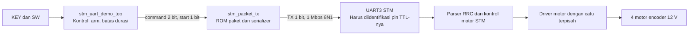

> Historical 0.1 RPS reference. Current updated project uses 1 RPS, two seconds and periodic refresh. Read ../FPGA_VERILOG_TUTORIAL.md for current instructions.

# DE10-Nano ke STM JetAuto tanpa laptop saat operasi

PENTING UNTUK KONDISI USER SAAT INI: header TTL STM belum diketahui dan hanya USB yang tersedia. Baca hps_usb/README_HPS_USB.md untuk jalur USB host HPS tanpa PC. SOF dalam paket ini khusus UART TTL GPIO, bukan USB host. Port STM sebenarnya sedang diperiksa pengguna dan belum boleh diasumsikan dari hub peripheral.

## Keputusan arsitektur

Untuk kontrol murni RTL: FPGA mengirim UART TTL ke UART kontrol STM. STM tetap menjalankan loop kontrol motor dan driver. FPGA mengirim setpoint dan izin. Tidak perlu Python, BAT, HPS atau Linux saat operasi.



Project demo ini TERPISAH dari IGOR. Tidak terintegrasi dengan safety_security_gate IGOR. Ini alat bring-up transport dan kontrol manual terbatas. Jangan menyebutnya sistem keselamatan kendaraan yang selesai.

## Apa yang sudah terbukti

Laptop COM9 menerima paket RRC valid dan buzzer STM berbunyi melalui method SDK asli. Command laptop ke STM bekerja untuk buzzer. Motor tetap tidak bergerak pada 0,1 maupun 0,2 rps. Penyebab motor belum diketahui. Memindahkan pengirim ke FPGA tidak otomatis memperbaiki masalah motor.

Simulasi RTL telah membandingkan 94 byte serial dari keempat command dengan frame hasil SDK. Start bit, data LSB dahulu, stop bit dan interval 1 mikrodetik per bit diperiksa. Simulasi kontrol memeriksa boot STOP, buzzer, penolakan motor tanpa arm, timeout gerak, dan STOP ketika arm dibatalkan. Testbench durasi kontrol dipercepat, UART tetap 1 Mbps. Hasil langsung pada FPGA/STM belum diuji.

## Titik sambungan yang benar

Manual Hiwonder menyatakan port kontrol menggunakan UART3 melalui rangkaian UART-to-USB. UART ekspansi lain belum tentu menuju parser kontrol yang sama. SDK tidak mendefinisikan pin hardware STM.

Sumber: https://docs.hiwonder.com/projects/JetAuto/en/jetauto-orin-nano/docs/1.quick_start_guide.html bagian 1.12.2.

JANGAN memasang kabel GPIO ke USB D+/D-. USB bukan UART TTL. USB-to-TTL dongle biasa juga bukan adaptor yang bisa dipasang antara dua perangkat USB tanpa host.

Koneksi di bawah baru boleh dipasang setelah header/test point UART3 STM dan level 3,3 V dibuktikan dari schematic atau pengukuran. Jangan menebak pin MCU seperti PB10/PB11 karena jenis STM dan mapping board belum dipastikan. Jika USB bridge masih tersambung ke RX STM yang sama, isolasikan pengirim bridge mengikuti schematic. Dua output TX tidak boleh disatukan. Mencabut kabel USB saja belum membuktikan bridge melepas output.

| DE10-Nano JP1 / GPIO0 | Signal dan pin FPGA | Ke STM |
|---|---|---|
| Pin fisik 2 | UART_TX, GPIO_0[1], E8 | RX UART3 TTL 3,3 V yang telah diverifikasi |
| Pin fisik 1 | UART_RX, GPIO_0[0], V12 | TX UART3 TTL 3,3 V yang telah diverifikasi |
| Pin fisik 12 atau 30 | GND | GND STM |

Pin fisik 11 adalah 5 V dan 29 adalah 3,3 V. Keduanya bukan GND. Gunakan orientasi pin 1 pada PCB/manual, bukan orientasi kamera. Catu DE10-Nano dan catu motor STM masing-masing sesuai manual. Jangan menyalurkan 12 V ke GPIO atau mencoba memberi daya motor dari header FPGA.

Sumber pin: manual Terasic DE10-Nano, Figure 3-20 dan Table 3-10: https://www.mouser.com/pdfdocs/E10-Nano_User_manual.pdf

Untuk buzzer pertama cukup TX FPGA dan common GND, setelah pin dan listrik diverifikasi. RX opsional pada demo ini dan hanya ditampilkan sebagai level pada LED5, belum didekode sebagai telemetri atau ACK.

## Jika STM hanya menyediakan USB

Alternatif tanpa PC eksternal adalah USB host HPS DE10-Nano dengan Linux. Pasang STM ke port USB host HPS yang sesuai, identifikasi /dev/serial/by-id atau /dev/ttyUSB* / ttyACM*, kemudian gunakan SDK pada ARM HPS. Nomor COM9 tidak berlaku di Linux. Jika kernel belum mengenali bridge USB, perlu driver sesuai VID/PID.

Arsitektur produksi dapat memakai FPGA untuk DWA dan safety, register Avalon-MM untuk setpoint/status, lalu daemon HPS sebagai transport USB. Jalur ini memerlukan desain Platform Designer, bridge dan software HPS tambahan, yang BELUM dibuat pada paket demo ini. Ini tetap tanpa laptop dan tanpa BAT, tetapi transport USB dijalankan processor HPS. Untuk benar-benar seluruh transport RTL, akses TTL UART3 STM harus tersedia atau diperlukan USB host controller yang jauh lebih kompleks.

## Buka dan program dengan Quartus

1. Buka quartus/stm_uart.qpf. Device harus 5CSEBA6U23I7, top module stm_uart_demo_top.
2. RTL terdapat di rtl/stm_uart_demo_top.v dan rtl/stm_packet_tx.v. QSF, SDC dan pin assignment sudah tersedia.
3. Jalankan Processing > Start Compilation. Periksa error dan timing sebelum memprogram. Jangan memakai SOF IGOR untuk demo ini.
4. Jika berhasil, file hasil ada di quartus/output_files/stm_uart.sof. Keberadaan file SOF harus diperiksa, jangan menganggap project source adalah bitstream.
5. Hubungkan USB-Blaster II, buka Tools > Programmer, mode JTAG, Hardware Setup pilih USB-Blaster II, Auto Detect lalu pilih Cyclone V yang benar. Tambahkan stm_uart.sof, centang Program/Configure dan Start.
6. Program sebelum memasang jalur TX ke STM atau dengan motor tidak di-arm. Setelah FPGA terkonfigurasi, TX idle HIGH 3,3 V.
7. Operasi setelah konfigurasi tidak membutuhkan laptop. FPGA tetap perlu daya. SOF dimuat ke SRAM dan hilang saat power off. Untuk boot mandiri setelah power cycle dibutuhkan image konfigurasi flash yang sesuai dengan skema boot board dan pengaturan MSEL. Paket ini belum menyediakan atau memprogram JIC/flash. Ikuti manual Terasic untuk flash/MSEL dan jangan menimpa image HPS/flash yang dipakai sebelumnya tanpa backup.

## Tes tombol langsung, tanpa BAT

Set SW3=0 dahulu dan angkat roda jika nanti mencoba motor. SW2 tidak dipakai.

| SW1 | SW0 | KEY1 setelah debounce 20 ms |
|---|---|---|
| 0 | 0 | STOP empat motor |
| 0 | 1 | Buzzer 1900 Hz, 100 ms, sekali |
| 1 | 0 | Maju +0,1 +0,1 -0,1 -0,1 rps, hanya jika SW3=1 |
| 1 | 1 | Mundur -0,1 -0,1 +0,1 +0,1 rps, hanya jika SW3=1 |

Mulai dengan SW1=0, SW0=1, SW3=0 lalu tekan KEY1. Buzzer harus berbunyi jika UART3 TTL yang benar menerima paket. Menahan KEY1 tidak mengulang command. Lepas lalu tekan kembali untuk command berikutnya.

Motor hanya 0,1 rps dan berhenti setelah sekitar 0,5 detik, satu frame STOP setelahnya. Tidak ada pengulangan motor 20 Hz pada demo ini. Jika firmware perlu refresh periodik, itu harus dibuktikan dan kemudian ditambahkan. SW3 ke 0 saat gerak meminta STOP setelah frame yang sedang dikirim selesai. Ini request software melalui UART, bukan pemutus daya motor. Tidak ada ACK, encoder feedback atau watchdog STM yang diverifikasi.

KEY0 adalah reset FPGA. Jangan menganggap menahan reset merupakan emergency stop. Reset dapat membatalkan frame serial, dan STOP boot baru dikirim setelah reset dilepas. Emergency fisik harus memutus daya motor melalui hardware yang sesuai.

LED0=serial busy, LED1=controller bukan idle, LED3:2=command terakhir, LED4=arm SW3, LED5=level RX, LED7:6=0. LED bukan bukti command diterima STM.

## Protokol dari SDK

1 Mbps, 8N1, tanpa flow control. Clock 50 MHz dibagi tepat 50 siklus per bit.

Frame: AA 55, function uint8, length uint8, payload, CRC-8/MAXIM. CRC dihitung dari function sampai akhir payload. Polynomial reflected 8C, init 00, xorout 00.

Motor: function 03, payload 22 byte, subcommand 01, count 04, empat entry ID uint8 zero-based dan speed float32 little endian dalam putaran/detik. Total 27 byte, serial nominal 270 mikrodetik.

Buzzer: function 02, payload 08, empat uint16 little endian berurutan frequency=1900, on_ms=100, off_ms=900, repeat=1. Total 13 byte, 130 mikrodetik.

```text
AA 55 02 08 6C 07 64 00 84 03 01 00 5D
```

ROM berisi packet dan CRC konstanta yang dihasilkan dari implementasi SDK-equivalent. Demo tidak memiliki konverter fixed-point ke float atau kalkulator CRC dinamis. Untuk integrasi IGOR, perlu format ulang hasil gerak menjadi setpoint empat roda, bounded conversion ke float, packet builder dan safety gate tepat sebelum transmisi. Total latency motor/robot belum bisa dihitung dari durasi serial saja.

## Status dan file bukti

RTL source, project Quartus dan dua simulasi tersedia. evidence memuat log build dan simulasi. stm_uart.vcd adalah waveform UART testbench. File generate_project.py adalah generator developer yang memakai folder paket laptop sebelah untuk frame referensi, tidak dibutuhkan saat menjalankan FPGA atau membuka project.

Build Quartus 25.1 Standard selesai melalui Analysis/Synthesis, Fitter, Assembler dan Timing Analyzer. File quartus/output_files/stm_uart.sof sudah dihasilkan untuk 5CSEBA6U23I7. Fitter: 123 ALM, 136 register, 0 RAM block, 0 DSP. Command flow compile.tcl sempat gagal memuat package qsysipc pada instalasi lokal, sehingga build dilakukan dengan executable quartus_map, quartus_fit, quartus_asm dan quartus_sta secara langsung. Semua log tersimpan di evidence. File SOF ini belum diprogram pada board.

Tidak ada klaim bahwa hardware DE10-Nano sudah mengendalikan STM. UART3 TTL STM, konflik dengan bridge USB, dan penyebab motor diam masih perlu diselesaikan.
