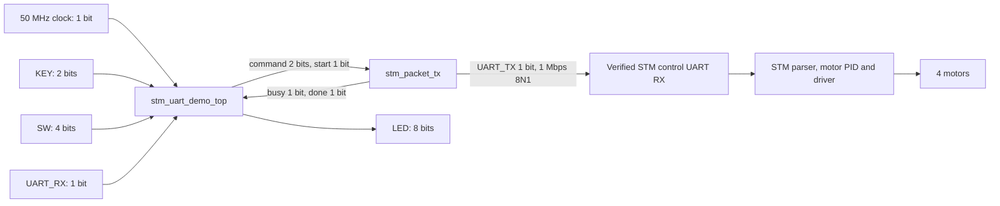

# DE10-Nano to JetAuto STM — full Verilog UART tutorial

## What has worked

The user confirmed that the recording run on 6 October 2026 moved the wheels in both directions and stopped. The successful laptop transport was COM9, CH9102, VID:PID 1A86:55D4, USB serial 5917012181, at 1 Mbps. Read SUCCESS_LAPTOP_STM.md for the evidence and reproduction command. COM10 was also connected but was not used for motor commands.

The updated FPGA project sends the same 1 RPS packets with a two-second motion limit and periodic refresh. Its simulation and Quartus results are separate from the laptop result. Physical FPGA-to-STM operation has not been tested.

## Connection requirement for pure Verilog

COM9 is a Windows USB device name. It is not an FPGA pin. The laptop communicates through a USB serial bridge, whereas the RTL demo produces UART TX at a GPIO pin.

Pure Verilog operation requires access to the STM control UART at the correct 3.3 V TTL RX pin, with shared ground. The user's STM connection currently exposes USB and its TTL control pins have not been identified. USB D+/D− cannot connect to FPGA UART TX/RX. An ordinary USB-to-TTL dongle needs a USB host and cannot connect two USB peripheral sockets by itself.

With USB only, the practical no-laptop architecture uses DE10-Nano HPS Linux as USB host. That path includes ARM software and is not the pure Verilog UART path. A USB host implemented in FPGA logic would require additional USB controller/PHY and bridge-driver work, absent from this project. Confirm a usable STM UART connection before expecting this SOF to control the robot.

## Project and modules

Copy the complete FPGA_UART_TTL folder. Open quartus/stm_uart.qpf. Device is **5CSEBA6U23I7**, top module **stm_uart_demo_top**.

| File | Role |
|---|---|
| rtl/stm_uart_demo_top.v | Power-on STOP, synchronized buttons/switches, debounce, arm, motion lease and refresh |
| rtl/stm_packet_tx.v | Four fixed SDK-compatible packet ROMs and UART serializer |
| tb/tb_packet.v | Checks all 94 serial bytes and 1 Mbps 8N1 timing |
| tb/tb_control.v | Checks arm, repeated frames, bounded hold, STOP and held-key suppression |
| quartus/stm_uart.qpf, stm_uart.qsf | Quartus project, device, top and source paths |
| quartus/pin_assignment.tcl | IO pins and voltage standard |
| quartus/stm_uart.sdc | 50 MHz clock constraint |
| quartus/output_files/stm_uart.sof | Updated programming image |
| evidence/verified_* | Current simulation/build logs |

This is a standalone motor-transport demo. It has not been integrated with IGOR or its safety gate. Python and BAT are not needed during TTL operation after FPGA configuration.

## Module breakdown and bit flow



The controller has a three-bit state register, a two-bit command register, a 27-bit hold counter and a 22-bit refresh counter. The sender has a five-bit byte index, four-bit serial-bit index, 16-bit bit timer and ten-bit shift register. UART_RX is only displayed as a level on LED5. It does not decode voltage, ACK or encoder data.

## Pin wiring

| Signal | DE10-Nano JP1 physical pin | FPGA pin | STM connection |
|---|---:|---|---|
| UART_TX | 2 | E8 | Verified 3.3 V control UART RX |
| UART_RX | 1 | V12 | Verified 3.3 V control UART TX |
| GND | 12 or 30 | Ground | Signal ground |

JP1 pin 11 is 5 V and pin 29 is 3.3 V. Neither is ground. Check the physical pin-1 marker before wiring. Assignments were checked against Figure 3-20 and Table 3-10, pages 27–28 of the [Terasic DE10-Nano manual](https://www.mouser.com/pdfdocs/E10-Nano_User_manual.pdf).

The exact STM pins are still unknown. Verify them from the actual schematic, not a guessed MCU pin number. If the USB bridge TX is already connected to STM RX, do not tie the FPGA TX onto that net without verified isolation. Power the FPGA and STM according to their own requirements. Never put 12 V motor power on GPIO. For the first buzzer test, only verified TX and common ground are needed. RX is optional in this demo.

## UART and packet details

At 50 MHz, CLKS_PER_BIT=50 produces exactly 1 Mbps. Each byte uses one LOW start bit, eight data bits LSB first and one HIGH stop bit. Idle is HIGH. Serializer shift words are `{1'b1,data[7:0],1'b0}` and contain ten bits.

RRC frame: `AA 55 FUNC LEN PAYLOAD CRC`. The reflected CRC polynomial is 0x8C, initial zero. CRC covers FUNC, LEN and PAYLOAD, excluding AA 55. Motor function is 03, payload length 16 hex, subcommand 01 and motor count 04. Each motor uses an ID byte 0–3 plus little-endian IEEE754 float32 speed in RPS. IDs in the Python SDK are 1–4 and are reduced by one in the packet.

| Command code | Payload/action |
|---:|---|
| 0 | STOP, all speeds zero |
| 1 | Buzzer 1900 Hz, 100 ms ON, repeat once |
| 2 | Forward, +1,+1,-1,-1 RPS |
| 3 | Backward, -1,-1,+1,+1 RPS |

```text
FORWARD, CRC 0D
AA 55 03 16 01 04 00 00 00 80 3F 01 00 00 80 3F 02 00 00 80 BF 03 00 00 80 BF 0D
BACKWARD, CRC 4C
AA 55 03 16 01 04 00 00 00 80 BF 01 00 00 80 BF 02 00 00 80 3F 03 00 00 80 3F 4C
STOP, CRC 07
AA 55 03 16 01 04 00 00 00 00 00 01 00 00 00 00 02 00 00 00 00 03 00 00 00 00 07
BUZZER, CRC 5D
AA 55 02 08 6C 07 64 00 84 03 01 00 5D
```

These full frames are stored in ROM. There is no dynamic float converter or CRC engine. A 27-byte motor frame takes nominally 270 µs on the wire. A 13-byte buzzer frame takes 130 µs. Neither number is the physical motor response latency.

## Controller operation and timing

State 0 sends boot STOP, state 1 waits for it, and state 2 is idle. A debounced KEY1 press selects SW1:0 and starts the first packet in state 3. A motor request without SW3 arm selects STOP instead. After a motor packet completes, state 4 begins the hold interval. State 7 waits for periodic refresh packets. States 5 and 6 issue and wait for STOP.

Default parameters: HOLD_CYCLES=100,000,000, DEBOUNCE_CYCLES=1,000,000, REFRESH_CYCLES=2,500,000. At 50 MHz these are two seconds, 20 ms and 50 ms. The hold timer advances during refresh transmission, so periodic packets do not renew the motion lease. The first refresh interval begins after completion of the initial frame. Later frame starts are approximately 50 ms apart.

Clearing SW3 or reaching the deadline requests STOP. If a frame is in progress, it completes before STOP starts, adding at most approximately 270 µs plus a few clocks. KEY0 can interrupt a frame and does not guarantee a physical emergency stop. A UART STOP request is not a hardware motor-power cutoff.

Holding KEY1 does not retrigger the session. Release it before pressing again. There is no ACK motor or STM watchdog verification in this RTL. The confirmed laptop run and this deterministic RTL refresh schedule share packet values, but host scheduling is not cycle-identical.

## Simulate

From FPGA_UART_TTL, with Icarus on PATH:

```powershell
New-Item -ItemType Directory -Force build
iverilog -g2012 -s tb_packet -o build/packet.vvp rtl/stm_packet_tx.v tb/tb_packet.v
vvp build/packet.vvp
iverilog -g2012 -s tb_control -o build/control.vvp rtl/stm_packet_tx.v rtl/stm_uart_demo_top.v tb/tb_control.v
vvp build/control.vvp
```

Both tests pass for the updated RTL. The packet test covers all 94 bytes across four commands. The control test covers boot STOP, buzzer, disarmed rejection, repeated commands, deadline, arm-clear STOP and held-button suppression. It uses shorter simulation debounce/hold/refresh parameters. Open stm_uart.vcd in GTKWave if desired.

## Compile and program

1. Install Quartus Standard with Cyclone V support. Open FPGA_UART_TTL/quartus/stm_uart.qpf.
2. Confirm device 5CSEBA6U23I7 and top stm_uart_demo_top. Processing → Start Compilation. Inspect current fit/timing reports in output_files.
3. Power DE10-Nano and connect USB-Blaster II/JTAG to the programming laptop.
4. Tools → Programmer → Hardware Setup, select DE-SoC USB-Blaster II, mode JTAG. Auto Detect if needed.
5. Assign quartus/output_files/stm_uart.sof to the FPGA. Check Program/Configure, Start and confirm 100%.
6. Keep SW3=0 and connect only verified TTL signals. Select buzzer and test first.
7. After configuration, the TTL demo runs without laptop control. SOF is volatile and is lost on power cycle. Automatic power-on boot requires suitable flash image and MSEL setup. No flash has been programmed in this work.

For command-line build, run from quartus with Quartus executables on PATH:

```powershell
quartus_map stm_uart
quartus_fit stm_uart
quartus_asm stm_uart
quartus_sta stm_uart
```

## Button tutorial

KEY0=reset, KEY1=command. SW2 is unused. Keep wheels raised for bench motion tests.

| SW1 | SW0 | KEY1 action |
|---:|---:|---|
| 0 | 0 | STOP |
| 0 | 1 | One beep |
| 1 | 0 | Forward for two seconds if SW3=1 |
| 1 | 1 | Backward for two seconds if SW3=1 |

Begin with SW3=0, SW1=0, SW0=1, then press/release KEY1. After buzzer succeeds on the verified TTL connection, set SW3=1 and select forward. Press/release KEY1. Observe movement and stop after two seconds. Select backward and repeat. Clear SW3 to request STOP earlier if needed.

LED0=sender busy, LED1=controller not idle, LED3:2=command code, LED4=arm, LED5=RX level, LED7:6=zero. LEDs do not prove STM execution.

## Physical acceptance and IGOR integration

Record buzzer, movement of each wheel, correct forward/backward behavior and physical STOP. Keep FPGA-to-STM status NOT TESTED until those observations are obtained. A successful simulation, LED or SOF does not prove the connection.

IGOR uses a different UART protocol and top igor_uart_top. Do not substitute its SOF for this transport demo. Integrating IGOR needs documented scaling, chassis inverse kinematics, bounded float conversion, dynamic packet/CRC generation and permission checks before transmission. Commands must be revoked when permission becomes zero. That integration and end-to-end latency are not implemented here.
