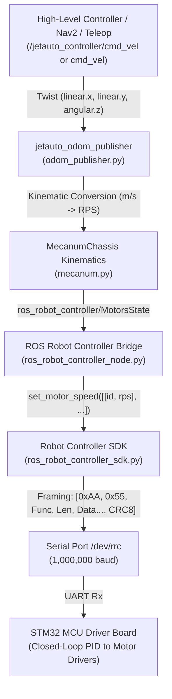

Here is the complete end-to-end flow of how motor speed commands travel from high-level ROS commands down to the serial payload sent to the STM32 motor controller on the JetAuto robot, along with key technical details.

---

### Architectural Overview



---

### Step-by-Step Flow

#### 1. High-Level Command Input
- **Node**: High-level planner (`move_base`), joystick node, or user script.
- **Topic**: `/jetauto_controller/cmd_vel` (or `cmd_vel` for app control).
- **Message Type**: `geometry_msgs/Twist`
  - $v_x$ (`linear.x`): Forward/backward velocity ($\text{m/s}$).
  - $v_y$ (`linear.y`): Lateral/strafing velocity ($\text{m/s}$).
  - $\omega_z$ (`angular.z`): Rotational velocity ($\text{rad/s}$).
- **Handling Node**: [`odom_publisher.py`](file:///home/karol/jetauto_backup/jetauto_ws/src/jetauto_driver/jetauto_controller/scripts/odom_publisher.py#L148-L173).
  - Note: In `app_cmd_vel_callback`, linear speeds are clamped to $[-0.2, 0.2]\,\text{m/s}$ and angular speeds to $[-0.5, 0.5]\,\text{rad/s}$.

---

#### 2. Inverse Kinematics Decomposition (Mecanum Chassis)
In [`odom_publisher.py`](file:///home/karol/jetauto_backup/jetauto_ws/src/jetauto_driver/jetauto_controller/scripts/odom_publisher.py#L168-L172), Cartesian velocities are converted to polar coordinates:
$$\text{speed} = \sqrt{v_x^2 + v_y^2}, \quad \theta = \text{atan2}(v_x, v_y)$$

Then passed to [`MecanumChassis.set_velocity()`](file:///home/karol/jetauto_backup/jetauto_ws/src/jetauto_driver/jetauto_sdk/src/jetauto_sdk/mecanum.py#L24-L51):
1. **Reconstruct Cartesian velocities:**
   $$v_x = \text{speed} \cdot \sin(\theta), \quad v_y = \text{speed} \cdot \cos(\theta)$$
2. **Rotational contribution:**
   $$v_p = \omega_z \cdot \frac{L + W}{2}$$
   *(where $L = \text{wheelbase} = 0.216\,\text{m}$, $W = \text{track\_width} = 0.195\,\text{m}$)*.
3. **Four-wheel linear velocities ($m/s$):**
   $$\begin{aligned}
   v_1 &= v_x - v_y - v_p \quad \text{(Motor 1: Front-Left)} \\
   v_2 &= v_x + v_y - v_p \quad \text{(Motor 2: Front-Right)} \\
   v_3 &= -v_x - v_y - v_p \quad \text{(Motor 3: Rear-Right)} \\
   v_4 &= -v_x + v_y - v_p \quad \text{(Motor 4: Rear-Left)}
   \end{aligned}$$
4. **Unit conversion to Rotations Per Second (RPS):**
   $$\text{rps}_i = \frac{v_i}{\pi \cdot D_{\text{wheel}}} \quad (D_{\text{wheel}} = 0.097\,\text{m})$$
5. Packaged into a `ros_robot_controller/MotorsState` message containing `[MotorState(id=1, rps), ...]` and published to `/ros_robot_controller/set_motor`.

---

#### 3. ROS Bridge Node Dispatch
- **Node**: [`ros_robot_controller_node.py`](file:///home/karol/jetauto_backup/jetauto_ws/src/jetauto_driver/ros_robot_controller/scripts/ros_robot_controller_node.py#L66-L70)
- Subscribes to `ros_robot_controller/set_motor`.
- In `set_motor_state()`, unpacks the ROS message into an array of `[[motor_id, rps], ...]` and calls the hardware SDK:
  ```python
  self.board.set_motor_speed([[1, rps1], [2, rps2], [3, rps3], [4, rps4]])
  ```

---

#### 4. Serial Frame Serialization
In [`ros_robot_controller_sdk.py`](file:///home/karol/jetauto_backup/jetauto_ws/src/jetauto_driver/ros_robot_controller/src/ros_robot_controller/ros_robot_controller_sdk.py#L313-L334):

1. **Sub-payload packing (`set_motor_speed`)**:
   - Sub-command: `0x01` (Set speed)
   - Number of motors: `0x04`
   - For each motor:
     - `motor_index`: `int(motor_id - 1)` (1 byte `uint8`, **0-indexed**: `0, 1, 2, 3`)
     - `target_rps`: `float(rps)` (4 bytes IEEE 754 float, little-endian: `<f`)
   - Sub-payload length: $2 + (4 \times 5) = 22\text{ bytes}$ (`0x16`).

2. **Frame encapsulation (`buf_write`)**:
   ```python
   buf = [0xAA, 0x55, 0x03, len(data)] + data
   buf.append(checksum_crc8(bytes(buf[2:])))
   self.port.write(buf)
   ```
   - Sent to serial port: `/dev/rrc` (symlink configured via udev rules for the STM32 USB-to-UART / Virtual COM port) at **1,000,000 baud** (1 Mbps).

---

### Detailed Serial Payload Structure

A complete packet commanding 4 motors is **27 bytes long**:

| Byte Offset | Field | Value / Type | Description |
|:---|:---|:---|:---|
| **0** | Header 1 | `0xAA` | Frame start marker byte 1 |
| **1** | Header 2 | `0x55` | Frame start marker byte 2 |
| **2** | Function ID | `0x03` | `PACKET_FUNC_MOTOR` (Motor control) |
| **3** | Data Length | `0x16` (22) | Total bytes in payload (excluding headers, func, length, and CRC) |
| **4** | Sub-command | `0x01` | Set motor speed sub-command |
| **5** | Motor Count | `0x04` | Number of motor entries |
| **6** | Motor 1 Index | `0x00` (`uint8`) | Motor 1 (0-indexed) |
| **7 – 10** | Motor 1 Speed | `float32` (`<f`) | Target speed in **RPS** (IEEE 754, Little-Endian) |
| **11** | Motor 2 Index | `0x01` (`uint8`) | Motor 2 (0-indexed) |
| **12 – 15** | Motor 2 Speed | `float32` (`<f`) | Target speed in **RPS** (IEEE 754, Little-Endian) |
| **16** | Motor 3 Index | `0x02` (`uint8`) | Motor 3 (0-indexed) |
| **17 – 20** | Motor 3 Speed | `float32` (`<f`) | Target speed in **RPS** (IEEE 754, Little-Endian) |
| **21** | Motor 4 Index | `0x03` (`uint8`) | Motor 4 (0-indexed) |
| **22 – 25** | Motor 4 Speed | `float32` (`<f`) | Target speed in **RPS** (IEEE 754, Little-Endian) |
| **26** | CRC-8 Checksum | `uint8` | CRC-8 lookup table calculated over **Byte 2 through Byte 25** |

---

### Critical Details You Need to Know

1. **Speed Unit is RPS (Revolutions Per Second), not RPM or rad/s**:
   - The STM32 firmware expects wheel rotational speed in **RPS**.
   - Formula: $\text{RPS} = \frac{v}{\pi \times D}$. If you write custom motor commands directly, do not pass RPM or rad/s without converting.

2. **1-Indexed in ROS vs 0-Indexed in Serial**:
   - The ROS message [`MotorState.msg`](file:///home/karol/jetauto_backup/jetauto_ws/src/jetauto_driver/ros_robot_controller/msg/MotorState.msg) uses IDs `1, 2, 3, 4`.
   - The SDK subtracts 1: `int(i[0] - 1)`, sending indices `0x00, 0x01, 0x02, 0x03` over serial.

3. **CRC-8 Calculation Range**:
   - The CRC-8 does **not** include the sync headers (`0xAA 0x55`).
   - The CRC is calculated starting from **Function ID (Byte 2)** up through the last byte of data:
     $$\text{CRC} = \text{checksum\_crc8}(\text{buf}[2:])$$
   - It uses a precomputed 256-byte lookup table (`crc8_table`).

4. **Endianness**:
   - All multi-byte numerical fields (e.g., the 32-bit floats for motor speeds) are packed as **Little-Endian** (`<f`).

5. **Serial Device and Baudrate**:
   - The port is `/dev/rrc` (configured via udev rule [`99-ttyACM0.rules`](file:///home/karol/jetauto_backup/jetauto_ws/src/jetauto_driver/ros_robot_controller/scripts/99-ttyACM0.rules) linking to the STM32 controller).
   - High speed: **1,000,000 baud** (1 Mbaud), 8 data bits, no parity, 1 stop bit (8N1).

6. **Safety & Shutdown Behavior**:
   - On node shutdown or termination, [`ros_robot_controller_node.py`](file:///home/karol/jetauto_backup/jetauto_ws/src/jetauto_driver/ros_robot_controller/scripts/ros_robot_controller_node.py#L54-L55) sends explicit zero-speed commands `[[1, 0], [2, 0], [3, 0], [4, 0]]` to stop the robot.
   - On the STM32 board, an onboard PID controller uses encoder feedback to track the target RPS and regulates PWM duty cycles to the motor driver H-bridges.
